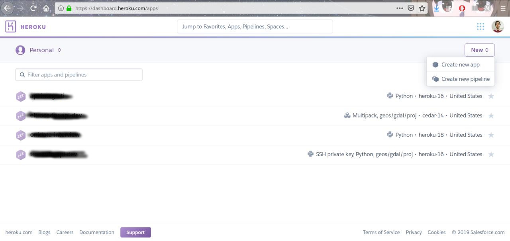
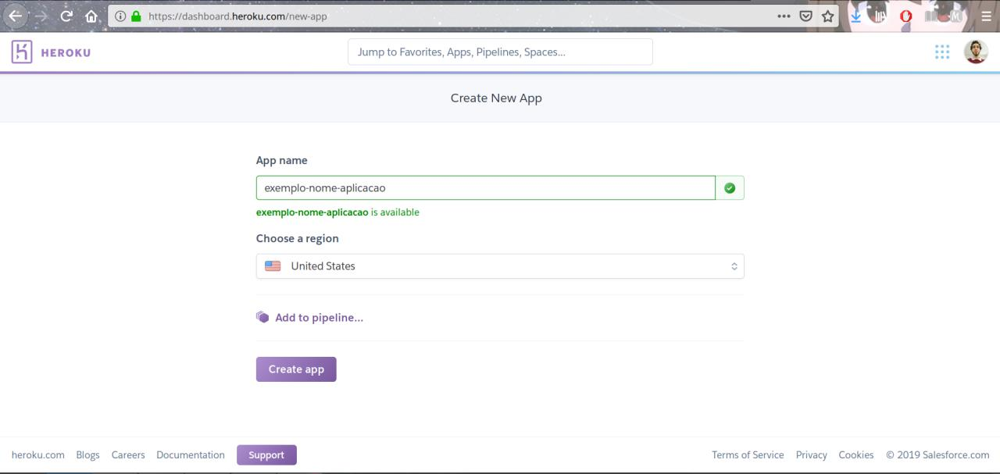
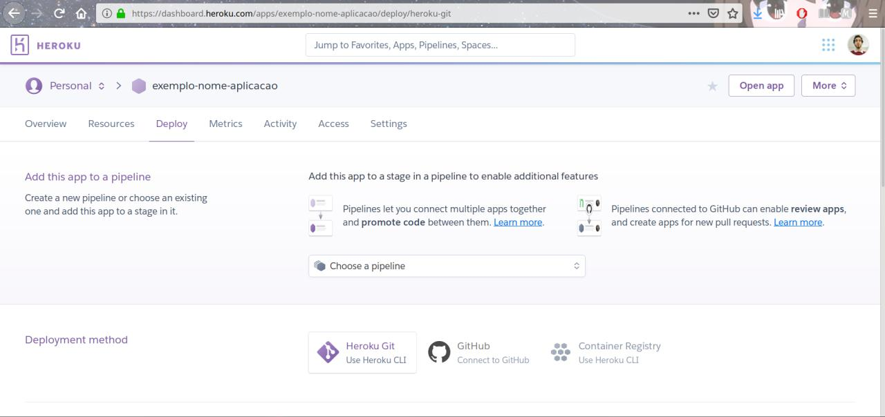

> Todos os repositórios do #DevOpsRN encontram-se no github https://github.com/jerimumhs/cpnatal2

# Workshop O que é Heroku e como utilizá-lo #CPNatal2
Repositório para a parte prática do workshop. Nessa parte, subiremos a aplicação que se encontra nesse repositório para o Heroku.

>Para essa parte prática, é necessário ter o [git](https://git-scm.com/) e o [heroku-cli](https://devcenter.heroku.com/articles/heroku-cli#download-and-install) instalados

# Criando conta no Heroku e aplicação
O primeiro passo é criar uma conta no [Heroku](https://www.heroku.com/).

Após entrar em sua conta, crie a aplicasdfghjklação com o nome que desejar.

> 

> 

> 

# Subindo aplicação
Clone esse repositório no seu computador com o comando 
```shell script
$ git clone https://github.com/rodrigondec/cpnatal2_intro-heroku.git intro_heroku
```

Autentique-se no heroku-cli utilizando o comando 
```shell script
$ heroku login
```

Abra a pasta do repositório no terminal
```shell script
$ cd intro_heroku
```

Adicione o remote do heroku no git 
```shell script
$ heroku git:remote -a exemplo-nome-aplicacao
```

Envie o código para sua aplicação do heroku
```shell script
$ git push heroku
```

Agora sua aplicação já está no heroku!

## Desafio
configurar uma variável de ambiente com o nome "ARG_EX" com algum valor arbitrário!
